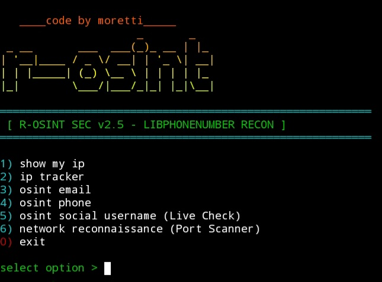
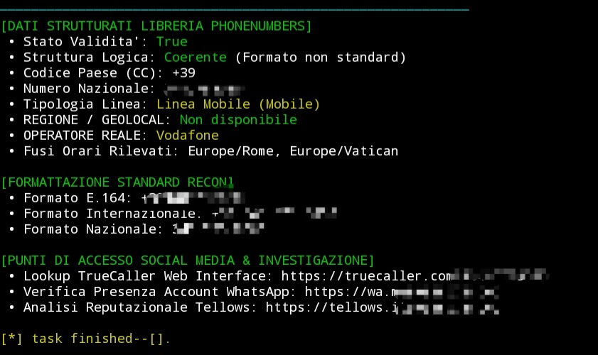

# r-osint
 
# where can I use this tool?
this tool can be used on termux. follow the instructions (under)
# about this tool
r-osint tool is an osint tool created by moretti in May 2026. This tool was created exclusively for educational purposes. We assume no responsibility for any improper or unauthorized use of this tool. The tool uses the phonenumbers library. Make sure it's installed before running it. 
# exemple

(italian version)
# requirements
```pkg install python -y```
```pip install phonenumbers```
# how to use
```pkg update && pkg upgrade -y```

```pkg install git python -y```

```git clone https://github.com/moretti-777/r-osint.git```

```cd r-osint```
# start tool
```python tool.py```
# what can this tool do?
this tool can find info with a phone number, e-mail or an IP.
# version
r-osint is now at version 2.5
wait some upgrades in future (maybe)
# bye bye <3
Thanks for trying out the r-osint tool. If you liked it, please give it stars at the repostory. thank you <3
# spoilers
``` wait for gold penguin tool... coming soon```
  
